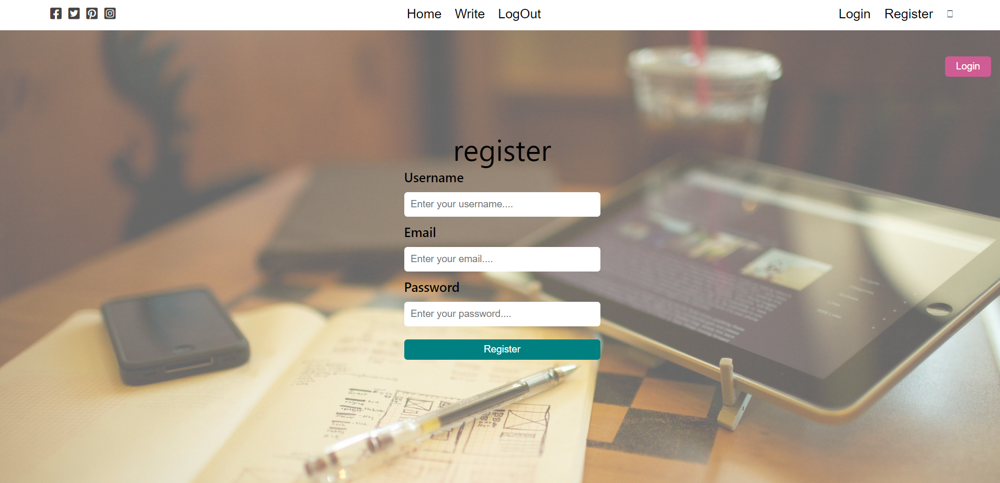

# Blog Website 📖

Live Link:- [Click Here...](https://amarjeet-writeme.vercel.app/)

### Technology Used  🧑‍💻
  - ` React JS `
  - ` Node JS `
  - ` Mongo DB `
  - ` Express JS `

 ## 👍 Feature of my Project 👍
 - User Registration
 - User Login
 - Read Any Artical
 - Write Artical
 - Edit Artical
 - Delete Artical
 - Update User Information
 - Delete User Account

<!-- New Feature 
 - 
 -  -->

## 👨‍💻 About Developer 👨‍💻
#
Hey I am Amarjeet Kumar, Fullstack Javascript Developer. Very much eager to explore and develop scalable, user friendly, robust applications. 

<!-- [Portfolio]() -->

[Linkdin](https://www.linkedin.com/in/amarjeet-kumar-46b79b236/)

[Instagram](https://www.instagram.com/amarkumar.aaryan.5/)

<!-- Live Link:- [Click Here!]() -->

Web View 🖥️

## ⏳ Meta Information ⏳
 - Time taken: 5 days

 - Upcoming Future Enhancement: Making It Responsive

## 😃 Thanks for spending your valuable time on this project 😃 